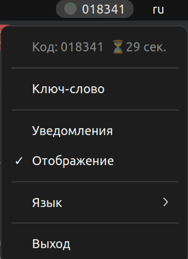

# SY_KY Ⓡ
- 🇧🇾 Приложение для генерирования кода в системном трее. 🇧🇾
 
# Основные функции:
- Выполняемые задачи:
  - Создание кода исходя из "Ключ-слово"
- Настраиваемый интерфейс:
  - Настройка отображения сгенерированного кода в трее.
  - Настройка отображения уведомления о создании нового сгенерированного кода в трее.
  
- Доступные языки интерфейса:
  - Русский
  - Английский
  - Китайский
  - Немецкий
---------------------------------------------------------------------------------

---------------------------------------------------------------------------------
ДЕМО
- <p>Видео демонстрация</p>
[](https://www.youtube.com/watch?v=ycvWWmWW-eo)

- <p>Трей приложения</p> 

---------------------------------------------------------------------------------

---------------------------------------------------------------------------------
-  ЗАПУСК В РЕЖИМИ РАЗАРБОТКИ. 

💡 Установка apt для Debian/Ubuntu (основные библиотеки).
```bash
sudo apt update
sudo apt install python3-gi python3-gi-cairo gir1.2-gtk-3.0 gir1.2-appindicator3-0.1
sudo apt install -y build-essential libgirepository1.0-dev gir1.2-glib-2.0 python3-gi python3-gi-cairo gobject-introspection
```

💡 Если буду проблемы при запуске.
```bash
sudo apt update
sudo apt install python3.10-dev
sudo apt install pkg-config
sudo apt install libcairo2-dev
sudo apt install build-essential
sudo apt install gnome-shell-extension-appindicator
pip install pygobject
```

💡 Python-зависимости.
```bash
pip install -r requirements.txt
```

💡 Запуск.
```bash
python3 app.py
```
---------------------------------------------------------------------------------

---------------------------------------------------------------------------------
- СБОРКА ПРИЛОЖЕНИЯ

💡 Сборка приложения в пакет (файлы и папки). В файле "build_deb.sh" вся структура проекта для сборки приложения!
```bash
chmod +x build_deb.sh
./build_deb.sh
```

💡 Проверьте, что пакет создался
```bash
ls -l *.deb
```

💡 Установка собранного пакета после успешной сборки
```bash
sudo apt install ./system-key_1.0.0_all.deb
```

💡 Удалить пакет (рекомендуемый способ)
```bash
sudo apt remove system-key
```

💡 Удалить пакет вместе с конфигурационными файлами
```bash
sudo apt purge system-key
```

💡 Убедится, что пакет удален 
```bash
which system-key
dpkg -l | grep systray
```
---------------------------------------------------------------------------------

---------------------------------------------------------------------------------
- ОБРАТНАЯ СВЯЗЬ

- Почта: olegpustovalov220@gmail.com 
- Телеграмм: @OlegEgoism